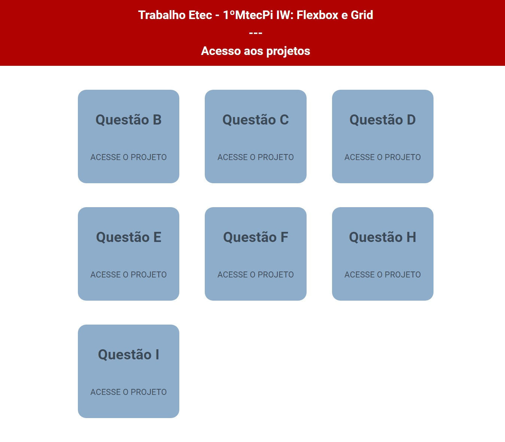

# Trabalho ETEC - 1ºMTECPI - Interfaces para WEB: Flexbox e CSS Grid

  

<h3 align="justify">Projetos práticos desenvolvidos durante o trabalho em grupo sobre Flexbox e CSS Grid da matéria Intefaces para web da série 1ºMtecPi da Etec Comendador João Rays.<h3>

 

## Tópicos
- [Imagem da página inicial](#img)
- [Acesso à página inicial dos projetos](#acesso)
- [Descrição](#desc)
- [Tecnologias utilizadas no geral](#tec)
- [Status de todos os projeto](#status)  
- [Membros do grupo](#membros)
- [Licença](#license)

 

<h2 id="img">🖥️ Imagem da página inicial</h2>

 

<h2 id="acesso">🔗 Acesso aos projetos</h2>

Clique [aqui](https://fel1324.github.io/ETEC-TrabalhoInterfacesParaWeb-Flexbox_CssGrid/) para acessar a página inicial dos projetos

 

<h2 id="desc">💻 Descrição</h2>

    Essa página web consiste em uma página inicial que tem o objetivo de permitir o acesso a todos os projetos do trabalho.

 

<h2 id="tec">🤖 Tecnologias utilizadas no geral</h2>

* HTML e CSS
* Javascript
* Git e Github

<h2 id="status">⌛ Status dos projetos</h2>

✔️ Todos os projetos do trabalho estão finalizados 🙌

 

<h2 id="membros">🧑‍🤝‍🧑 Membros do grupo</h2>

* José Francisco dos Santos Neto
* Matheus Nunes Bertolini
* Rafael Roberto de Oliveira

 

<h2 id="license">📝 Licença</h2>

Todo esse trabalho está sob a licença MIT.
